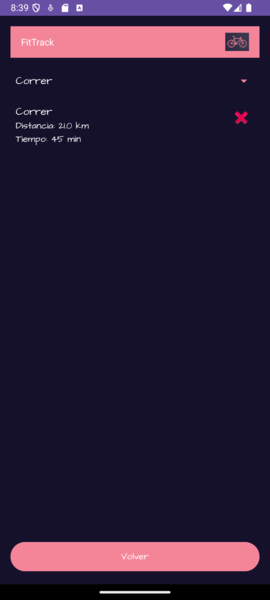
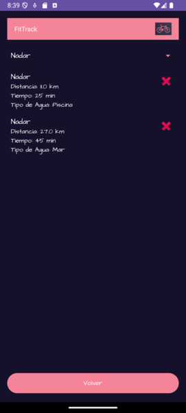

# FitTrack

## Descripción del Proyecto

FitTrack es una aplicación móvil, realizada con Android Studio para la asignatura de Laboratorios de Dispositivos Móviles, diseñada para gestionar y registrar actividades deportivas, como correr, nadar y hacer ciclismo. La aplicación proporciona funcionalidades de seguimiento del progreso, registro de actividades, y un sistema de logros que motiva a los usuarios a mantenerse activos. A través de una interfaz intuitiva, los usuarios pueden visualizar su rendimiento, establecer metas y recibir recompensas en forma de logros con audio motivacional.

## Funcionalidades Principales

- **Registro de Actividades**: Los usuarios pueden registrar actividades deportivas ingresando datos como distancia, tiempo, tipo de actividad, velocidad (para ciclismo), y especificar si la actividad de natación fue en piscina o mar.

- **Visualización del Progreso**: Los usuarios pueden visualizar un historial filtrable de sus actividades, con detalles específicos según el tipo de actividad (por ejemplo, velocidad máxima para ciclismo o ubicación para natación).

- **Logros**: El sistema de logros permite a los usuarios desbloquear recompensas tras alcanzar objetivos y escuchar sonidos motivacionales asociados.

- **Pantalla de Ayuda**: Incluye un manual de usuario detallado para guiar a los usuarios en la utilización de la aplicación.

## Pantallas de la Aplicación

### Pantalla Principal
La pantalla principal actúa como punto de entrada a la aplicación, con botones que permiten navegar a otras funcionalidades:
- Ver Progreso
- Registrar Actividad
- Ver Logros
- Ayuda

### Pantalla de Progreso
Muestra una lista de las actividades realizadas, con la opción de filtrarlas por tipo (correr, nadar, ciclismo o todas). También permite eliminar actividades y revisar detalles de las mismas.

### Pantalla de Registro de Actividad
Permite registrar nuevas actividades ingresando datos como distancia, tiempo, tipo de actividad, velocidad máxima (para ciclismo), o si fue en piscina o mar (para natación).

### Pantalla de Logros
Muestra una lista de logros alcanzados, con un botón para reproducir el sonido asociado a cada logro.

### Pantalla de Ayuda
Presenta un manual de usuario que explica cómo utilizar la aplicación y sus funcionalidades.

## Tecnologías Utilizadas

- **Room Database**: Utilizado para gestionar la persistencia de los datos de las actividades registradas.
- **RecyclerView**: Para mostrar dinámicamente las actividades y logros en listas.
- **Fragments**: Para facilitar la navegación y reutilización de componentes en la interfaz de usuario.
- **MediaPlayer**: Para gestionar la reproducción de sonidos motivacionales y otros audios dentro de la aplicación.
- **Spinner**: Para permitir la selección de filtros (tipo de actividad) en la pantalla de progreso.

## Clases Principales

- **Room (Base de Datos)**: Gestiona la persistencia de datos utilizando SQLite. Las entidades y DAOs permiten realizar operaciones CRUD eficientemente.
- **RecyclerView (Visualización de Listas)**: Muestra las actividades y logros en listas dinámicas, gestionando la interacción con los elementos a través de un adaptador personalizado.
- **Fragments**: Las pantallas de la aplicación se implementan utilizando fragments, facilitando la navegación y reutilización de componentes.
- **MediaPlayer**: Se utiliza para reproducir sonidos asociados a los logros y otros audios importantes.
- **Spinner**: Permite filtrar actividades por tipo en la pantalla de progreso.
- **Adaptador**: Gestiona cómo se muestran los datos en las listas de RecyclerView.

## Imágenes

*Pantalla Principal*

*Pantalla Progreso (Todas)*

*Pantalla Progreso (Correr)*

*Pantalla Progreso (Nadar)*

*Pantalla Progreso (Ciclismo)*

*Pantalla Registro (Correr)*

*Pantalla Registro (Nadar)*

*Pantalla Registro (Ciclismo)*

*Pantalla Logros*

*Pantalla Ayuda*
